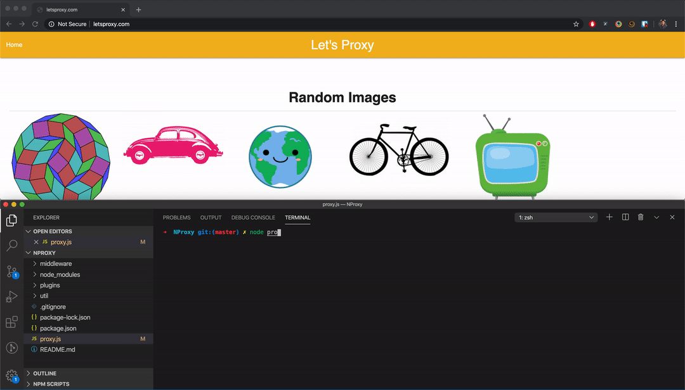

# NProxy
A Simple HTTP Proxy made with the ability to add plugins as middleware.

# Features
- Intercept Requests
- Modify the Intercepted data
- Block Resources from being Fetched

# Purpose
- Built for those who would like to learn how a simple proxy works and how easy it is to build one by yourself.
- Opening the endless ways of configuration which can be attained by the plugins as middleware

# How to use?
- Clone the repository
- `cd NProxy`
- Before running the proxy, add the HTTP proxy settings to your browser or whole system, i.e. `IP Address : localhost` and `Port : 4998`.
- Start the proxy by running `npm start`.
- Try visiting any `http` site and see for yourself!

# Preview
- Blocking of Assets using NProxy

# Future Updates
- NProxy currently support only HTTP requests. This can be extended to handle HTTPs requests.

# Contributions
- I am open for any sort of PRs or contributions and would be happy to have any.
